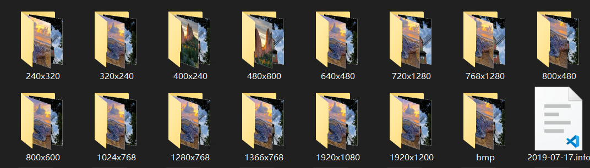

# 不同分辨率下图像相似性检验算法的准确性和适用性实验

## 实验算法

- [利用图像原始全局直方图进行相似性判别](ColorHistogram/README.md)
- [利用图像归一化全局直方图进行相似性判别]
- [利用图像归一化全局直方图进行相似性判别]
- [利用图象尺度不变性特征(Scale-Invariant Feature Transform, SIFT)进行相似性判别]
- [哈希算法]

## 实验过程

分别测试所选算法在下列情况下的准确性(相似性检验结果大于0.85即85% 则认为相似性较高)：
- 同一幅图像，不同分辨率情况下相似度检验 
- 图像不同但相似的同分辨率和不同分辨率
- 图像不同且不相似的同分辨率和不同分辨率

## 实验准备

- 实验所用所有图片均来自[@这个网站](https://bing.ioliu.cn)， 下载不同分辨率的图片，如下图
  
- OpenCV 编译 4.5.1 版本 x86(考虑可能之后会在32平台运行)
- Qt 5.15.2 主要用来组织管理工程，也是最后程序实现的平台
